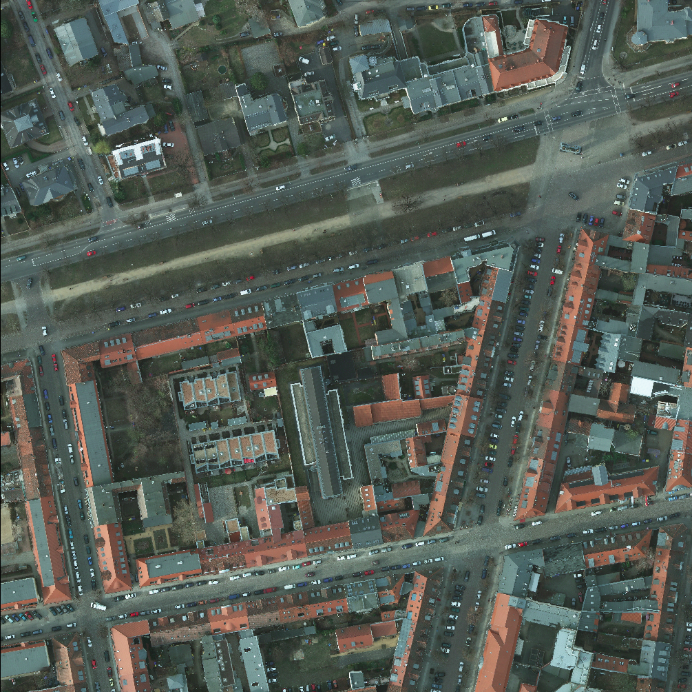
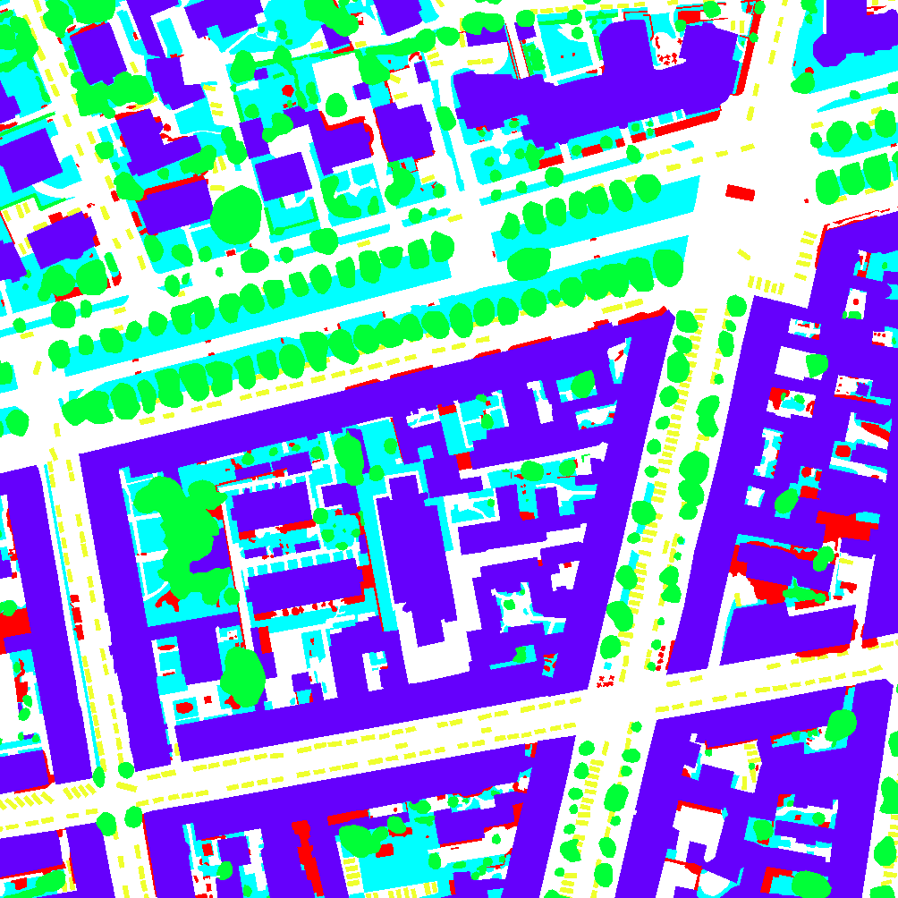
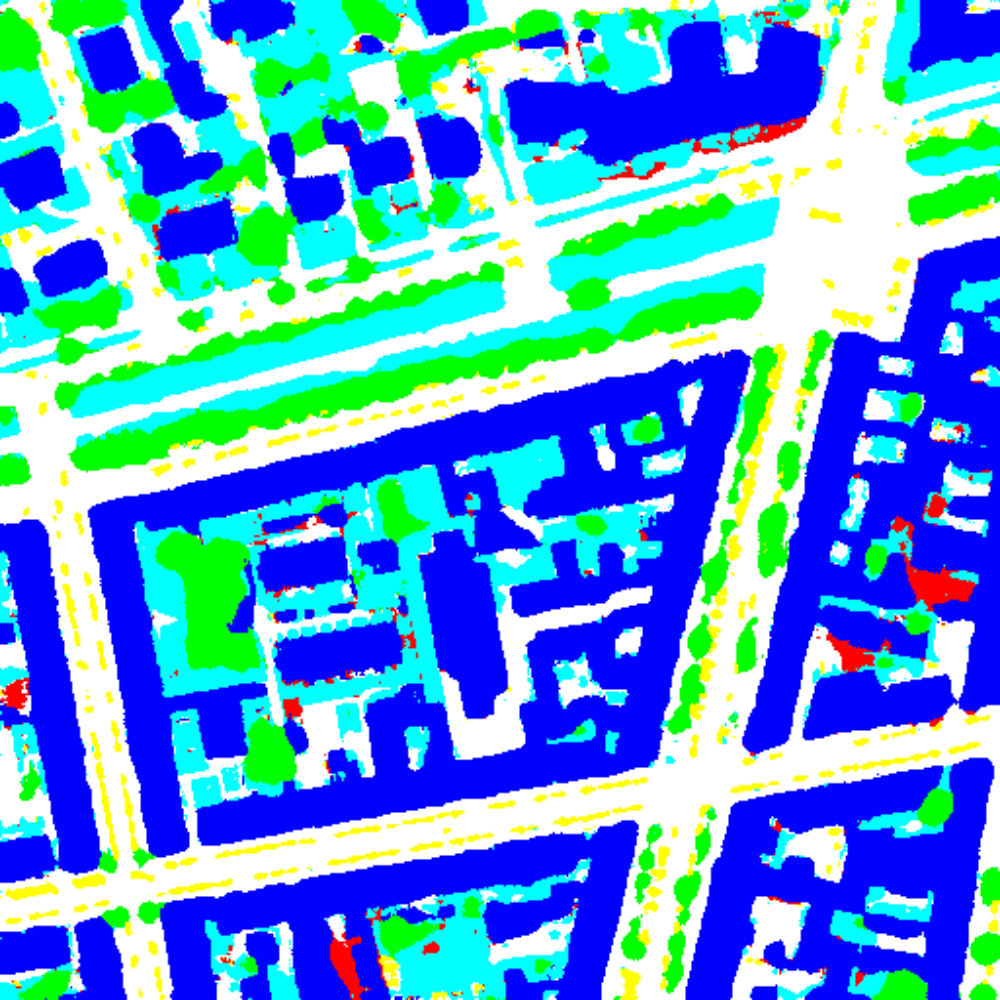

# Neural-Network-Image-Classification

This repository containis code for semantic segmentation of satellite image. Each pixel of the image is classified into one of the six class. U-Net model from the paper [U-Net: Convolutional Networks for Biomedical Image Segmentation](https://arxiv.org/abs/1505.04597) is used to perform this task. The model was implemented in Tensorflow v2.0 and trained on Google Colab. This work was done in partial fulfilment of the course CE F417 (Application of AI in Civil Engineering), Civil Engeenering Department, [BITS Pilani](https://www.bits-pilani.ac.in/), India.

## Preview

Satellite Image             |  Label Image
:-------------------------:|:-------------------------:
  | 

## Data
- Data was used from 2D Semantic Labeling Contest conducted by [ISPRS](https://www.isprs.org/) (International Society for Photogrammetry and Remote Sensing). 
- Datset contains of satellite images from two german cities Potsdam and Vaihingen and their corrosponding label images.
- While Vaihingen is a small village, potsdam is a city.
- Each image has a resolution of 6000 x 6000.
- There are six categories in the dataset.
    - ⬜ Impervious surfaces
    - 🟦 Buildings
    - 🎫 Low Vegetation
    - 🟩 Trees
    - 🟨 Cars
    - 🟥 Clutter/Background
- More details can be found at [this](https://www2.isprs.org/commissions/comm2/wg4/benchmark/semantic-labeling/) link.

## Data Preprocessing
- All the images were resized to 512 x 512.
- Each pixel of label images was one hot encoded.

## Model

Standard U-Net architecture was trained on the dataset to perform the task.

## Results

- Model achieved an accuracy of 70%.

Label Image             |  Predicted Image
:-------------------------:|:-------------------------:
  | 